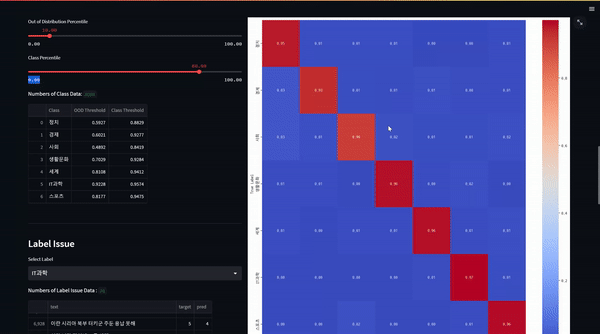

# level2_nlp_datacentric-nlp-04
- [level2\_nlp\_datacentric-nlp-04](#level2_nlp_datacentric-nlp-04)
  - [📄 프로젝트 소개](#-프로젝트-소개)
  - [🗓️ 개발 기간](#️-개발-기간)
  - [👨‍👨‍👧‍👧 멤버 구성 및 역할](#-멤버-구성-및-역할)
  - [👨‍🔬 실험 내용](#-실험-내용)
    - [Augmentation](#augmentation)
      - [Augmentation with GPT](#augmentation-with-gpt)
      - [Back Translation Data Augmentation](#back-translation-data-augmentation)
    - [Data Noise Filtering](#data-noise-filtering)
    - [Data Clearing](#data-clearing)
    - [Miss Label Filtering](#miss-label-filtering)
  - [🎛️ Data Controll Center](#️-data-controll-center)
    - [1. 실행 방법](#1-실행-방법)
    - [2. 오류 발생시](#2-오류-발생시)
      - [a. 폰트를 설치하였으나 폰트를 찾을 수 없다 하는 경우.](#a-폰트를-설치하였으나-폰트를-찾을-수-없다-하는-경우)
      - [b. "1. 실행 방법" 3번에서 실행되지 않는 경우.](#b-1-실행-방법-3번에서-실행되지-않는-경우)
    - [3. Function](#3-function)
      - [Easy Miss Label Filtering](#easy-miss-label-filtering)
  - [👑 Leaderboard](#-leaderboard)


## 📄 프로젝트 소개
- 연합뉴스의 뉴스 제목을 입력으로 받아 IT과학, 경제, 사회, 생활문화, 세계, 스포츠, 정치 총 7개의 클래스로 분류하는 프로젝트로, 기존에 주어진 baseline 코드에서 모델 구조와 hyperparameter 변경 없이 데이터를 중심의 성능 향상을 목표로 한다. 
- 총 학습 데이터는 **45,678개** 이며, Train Data / Validation Data를 7:3비율로 나누어서, 학습에 이용하였다. 
- Train Data의 **12%(5,481개)** 에는 g2p(grapheme to phoneme)가 적용되어 뉴스 제목에 노이즈가 있고, **3%(1,371개)** 에는 target이 text와는 맞지 않는 Miss Label 노이즈가 있다. 
- Test Data는 총 9,107개로 구성되어 있다. 
- 
## 🗓️ 개발 기간
* 23.05.22 - 23.06.01(총 11일)

## 👨‍👨‍👧‍👧 멤버 구성 및 역할

| [곽민석](https://github.com/kms7530) | [이인균](https://github.com/lig96) | [임하림](https://github.com/halimx2) | [최휘민]() | [황윤기](https://github.com/dbsrlskfdk) |
| :----: | :----: | :----: | :----: | :----: |
|  |  |  |  |  |

* **곽민석** 
    - Augmentation with Generative Model 
    - Build data managing page
* **이인균** 
    - Data Filtering
    - Data Augmentation
* **임하림** 
    - Data Filtering
    - Data Clearing
* **최휘민** 
    - Back Translation Data Augmentation 
    - Augmentation Data Filtering 
* **황윤기** 
    - Data Filtering 
    - Prediction, Miss Label Data Analysis Page 
    - Synthetic Data Augmentation 

## 👨‍🔬 실험 내용
### Augmentation
#### Augmentation with GPT
- 유료 서비스를 사용할 수 없는 관계로 “kakaobrain/kogpt” 모델을 서버에서 작동시켜 프롬프트를 이용해 데이터를 추출하였다. 
- 프롬프트에 따라 결과물의 질이 달라 여러 시행착오 끝에 아래와 같은 프롬프트를 사용하여 데이터를 생성하였다. 
  ```
  아래와 같이 키워드를 이용하여 기사 제목을 제작해줘. 

  입력: IT과학
  출력: ‘AI 산업의 쌀’ GPU 시장 독점한 엔비디아

  입력: 정치
  출력: 군, 북한 발사체 잔해 인양작전 본격화…심해잠수사 투입

  입력: {keyword}
  출력:
  ```
- 프롬프트를 이용하여 생성한 데이터의 예시는 다음과 같다. 
  ```
  입력: IT과학
  출력: KT, '기가 인터넷' 서비스 출시
  ```
- 위의 방법을 사용하여 각 라벨별로 1,200개 총 8,400개의 데이터를 생성하였으며, 이에대한 결과물은 [링크](https://github.com/boostcampaitech5/level2_nlp_datacentric-nlp-04/blob/main/dataset/gpt_generated_raw.csv)를 통해 볼 수 있다.   

#### Back Translation Data Augmentation
- [구글번역기](https://pypi.org/project/googletrans/)와 [파파고 API](https://developers.naver.com/docs/papago/README.md)를 사용하여 noise로 인식하지 않은 데이터에 한하여 Back Translation Data Augmentation을 하였다.
- 문장 임베딩 능력이 뛰어난 SBERT 모델로 원본과 생성한 데이터의 유사도에 따라 filtering 하였습니다.

### Data Noise Filtering
- G2P가 적용되지 않은 문장과 적용된 문장을 입력으로 받아 noise의 여부를 이진 분류하는 모델(Accuracy 93%)을 만들어 이를 활용해 데이터의 일부를 제거하였다.
- g2p로 변환한 데이터를 한번 더 g2p를 적용시켜서 달라지지 않는다면 noise가 있다고 판단해서 분리시켰다.

### Data Clearing
- 10만개의 원본문장과 g2p된 문장쌍을 Bart-base 모델로 학습시켜 사용하려고 했으나 생각보다 번역결과가 좋지 않아 사용하지 않았고, 50만개로 MT5-large로 학습한 모델을 이용해서 noise를 되돌려 dataset을 만들어 학습시킨 것을 사용했다.
- 원본으로 돌려준 문장에서 특수문자가 있는 경우에는 � 로 표시되어 공백으로 제거했다.


### Miss Label Filtering
- 잘못 예측한 결과의 확률을 Class별 오름차순으로 나열, 백분위 기준 Threshold이상이 되는 Prediction을 Target으로 재구성하여, Miss Label을  Filtering
- 예측결과 확인과, Filtering을 손쉽게 적용하고, 팀원들과의 공유 편의성을 위해 아래 작성한 Data Controll Center Page에 해당 기능 추가.


## 🎛️ Data Controll Center
### 1. 실행 방법
1. `main.py` 내에 `FILE_PATH` 변수를 
2. 다음의 명령어를 이용하여 dependency를 설치 해주셔야 합니다. 

```
pip install streamlit
pip install matplotlib
apt-get install fonts-nanum*
```

3. 다음 명령어를 이용하여 실행하시면 됩니다. 

```
streamlit run main.py --server.port PORT_NUMBER
```
### 2. 오류 발생시
#### a. 폰트를 설치하였으나 폰트를 찾을 수 없다 하는 경우. 

- upstage 서버 기준으로 다음의 명령어를 실행한 후 다시 실행 시켜보시기 바랍니다. 

```
rm -rf /opt/ml/.cache/matplotlib
```

#### b. "1. 실행 방법" 3번에서 실행되지 않는 경우. 

- 다음의 명령어를 이용하여 실행 시켜보시기 바랍니다. 

```
streamlit run main.py --server.port PORT_NUMBER --server.fileWatcherType none
```

### 3. Function
#### Easy Miss Label Filtering

- `Class Percentile` Value를 조절해서, Miss Label의 변경을 관찰하세요!
- `OOD(Out of Distribution)` 을 제외하고, Miss Label이 Filtering된 Data를 쉽게 다운로드하세요!
> 해당 기능을 사용하기 위해선, Miss Label Filtering을 시행할 데이터의 예측확률이 필요합니다.  
> ‼️ `Training.ipynb` 를 꼭 끝까지 실행해주세요


## 👑 Leaderboard
|           |  f1  |accuracy|Rank|
|-----------|:----:|:------:|:-:|
|**Public** |0.8815| 0.8792 | 7 |
|**Private**|0.8650| 0.8682 | 4 |
